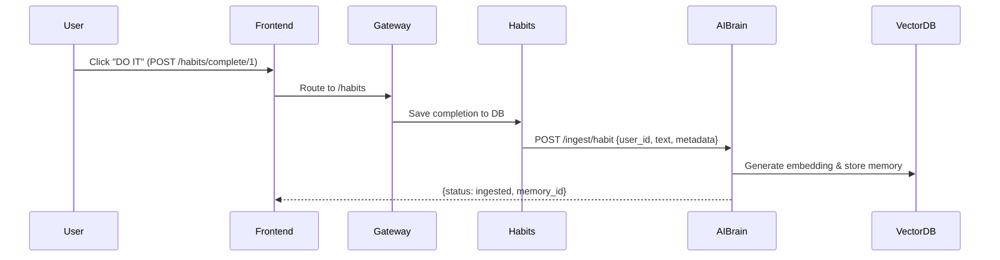
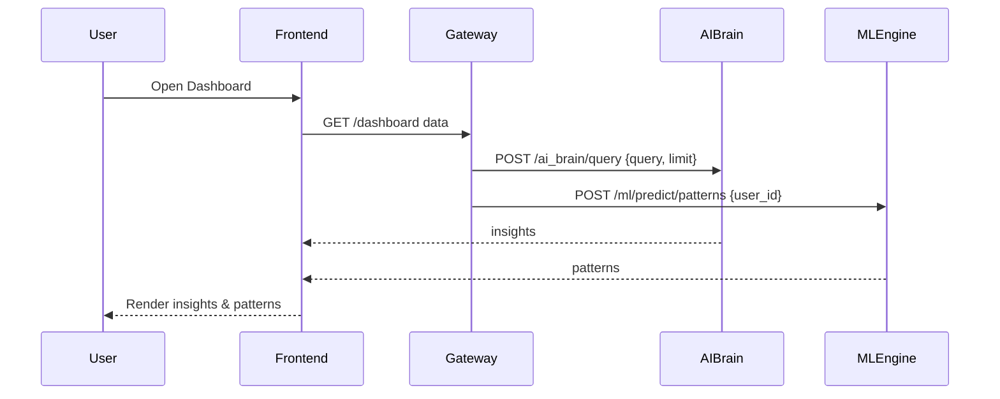

# 🧠 Kilo AI System Data Flow & Module Interactions
!## Overview: How Data Flows Through The System

```mermaid
flowchart LR
  subgraph User[User (Tablet)]
    U[User]
  end

  subgraph Frontend[Frontend (React)]
    F[/Frontend/]
  end

  subgraph Gateway[Gateway :8000]
    G[/Gateway/]
  end

  subgraph Modules[Modules]
    H[Habits :9003]
    M[Meds :9001]
    Fi[Finance :9005]
    R[Reminder :9002]
    V[Voice :9009]
    Cam[Cam :9007]
  end

  subgraph AIBrain[AI Brain :9004]
    AI[AI Brain]
  end

  subgraph MLEngine[ML Engine :9008]
    ML[ML Engine]
  end

  U --> F --> G --> Modules
  Modules --> AI
  AI --> ML
  ML --> F
  F --> U
```

### Detailed flows





---

## 1. Data Input Flow (User → AI Brain)

### Example: User Adds a Habit

```
┌─────────────┐
│   USER      │ Clicks "DO IT" on "Morning Exercise" habit
└──────┬──────┘
       │
       v
┌─────────────┐
│  FRONTEND   │ POST /habits/complete/1
│ (React)     │
└──────┬──────┘
       │
       v
┌─────────────┐
│  GATEWAY    │ Routes to habits service
│  :8000      │
└──────┬──────┘
       │
       v
┌─────────────┐
│  HABITS     │ 1. Saves completion to DB
│  :9003      │ 2. Sends to AI Brain for ingestion
└──────┬──────┘
       │
       v
┌─────────────┐
│  AI BRAIN   │ POST /ingest/habit
│  :9004      │ {
│             │   "user_id": "kilo",
│             │   "habit_name": "Morning Exercise",
│             │   "completed_at": "2025-12-22T10:30:00",
│             │   "streak": 5
│             │ }
│             │
│             │ 1. Creates memory embedding (sentence-transformers)
│             │ 2. Stores in vector database
│             │ 3. Updates knowledge graph
└─────────────┘